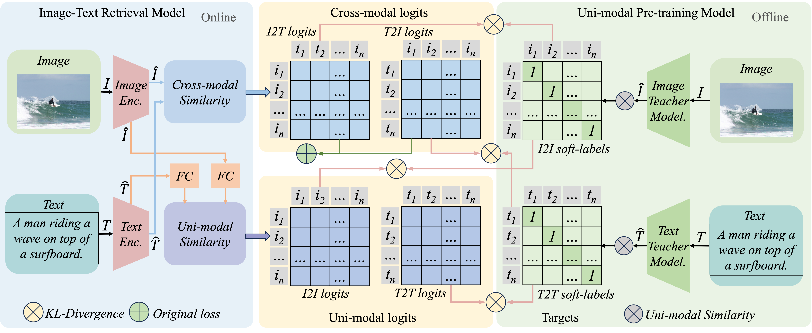

# Cross-Modal and Uni-Modal Soft-Label Alignment for Image-Text Retrieval
This is the source code of our AAAI 2024 paper "Cross-Modal and Uni-Modal Soft-Label Alignment for Image-Text Retrieval"
[ [Paper](https://doi.org/10.1609/aaai.v38i16.29789) | [Appendix](_doc/Appendix_CUSA.pdf) ]

## Quick Links

- [Cross-Modal and Uni-Modal Soft-Label Alignment for Image-Text Retrieval](#cross-modal-and-uni-modal-soft-label-alignment-for-image-text-retrieval)
  - [Quick Links](#quick-links)
  - [Overview](#overview)
- [Usage](#usage)
  - [Getting Started](#getting-started)
    - [Environment Installation](#environment-installation)
    - [Data Preprocessing](#data-preprocessing)
  - [Training \& Evaluation](#training--evaluation)
  - [Q\&A](#qa)
- [Citation](#citation)

## Overview
We propose a novel method called Cross-modal and Uni-modal Soft-label Alignment (CUSA) to solve the inter-modal matching missing problem and the intra-modal semantic loss problem in existing image-text retrieval. The following figure is an illustration of our methods.



# Usage

## Getting Started

### Environment Installation

See `requirements.txt`

<details>
<summary>For training and limited evaluation</summary>

```bash
# python >= 3.9
pip install torch==2.0.1 torchvision==0.15.2 torchaudio==2.0.2 --index-url https://download.pytorch.org/whl/cu118
pip install transformers sentence-transformers tqdm scikit-learn ftfy
```

</details>

<details>
<summary>For evaluation</summary>

```bash
# -- ECCV Caption --
# 1. For more detailed information, please refer to https://github.com/naver-ai/eccv-caption
pip install eccv_caption pycocotools ujson

# -- Img Retrieval --
# 1. Our repository contains the relevant code.
# 2. For more detailed information, please refer to https://github.com/deepglint/unicom
pip install pandas

# -- STS --
# 1. Get code from https://github.com/princeton-nlp/SimCSE
# 2. Install SentEval
git clone https://github.com/princeton-nlp/SimCSE.git
# find file "SimCSE/SentEval/senteval/sts.py"
# Modify lines 42 and 43 of the code to read as follows:
# <42> sent1 = np.array([s.split() for s in sent1], dtype=object)[not_empty_idx]
# <43> sent2 = np.array([s.split() for s in sent2], dtype=object)[not_empty_idx]
cd SimCSE/SentEval
pip install .
pip install prettytable
```

</details>

### Data Preprocessing

<details>
<summary>
Image Text Retrieval training/evaluation
</summary>

You should see albef (https://github.com/salesforce/ALBEF) to build a dataset.

For more data examples, see the folder `dataset_example`.

Here is the data format:
`train.json`
```json
[
  {
        "image_path": "<absPath>/COCO_val2014_000000391895.jpg",
        "caption": "A man with a red helmet on a small moped on a dirt road. ",
        "image_id": "COCO_val2014_000000391895.jpg"
  },
]
```

`train_unicom.npy`
```json
{ "<image_id>1": "<feature>", }
```

</details>


<details>
<summary>
Image retrieval task evaluation
</summary>

You can see the code file: `evaluation_img.py`
For more detailed information, please refer to https://github.com/deepglint/unicom

</details>

<details>
<summary>
STS task evaluation
</summary>

You can see the code file: `evaluation_sts.py`
For more detailed information, please refer to https://github.com/princeton-nlp/SimCSE

</details>

## Training & Evaluation

Training Scripts:

```bash
torchrun --nproc_per_node=4 --master-port 25110 retrieval.py --config "<configPath>"

# Test environment installation successful.
torchrun --nproc_per_node=4 --master-port 25110 retrieval.py --config "./configs/test.yaml"

# e.g.
torchrun --nproc_per_node=4 --master-port 25110 retrieval.py --config "./configs/vitb32/coco/only_contrastive.yaml"
torchrun --nproc_per_node=4 --master-port 25110 retrieval.py --config "./configs/vitb32/coco/cusa.yaml"
```

Evaluation Scripts:

```bash
# -- ECCV Caption --
# see evaluation_eccv.py
python evaluation_eccv.py

# -- Img Retrieval --
# see evaluation_img.py
python evaluation_img.py

# -- STS --
# see evaluation_sts.py
python evaluation_sts.py
```

## Q&A
NOTE: The submitted code is code that has been refactored, so in some cases it may contain some bugs that we didn't catch, but that doesn't affect the results in our paper.

If you have any questions, please submit an [issue](https://github.com/lerogo/aaai24_itr_cusa/issues/new) or contact lerogohl\<AT\>gmail.com or huanghl\<AT\>buaa.edu.cn.

> 1. Datasets, Checkpoints(re-run), and Logs(re-run) can be found at this link: [google drive](https://drive.google.com/drive/folders/19vCLPr9uoR-_HNQ9ViZXVJz6S0fbxaFf)


# Citation

If you find this method or code useful, please cite

```bibtex
@inproceedings{huang2024cusa,
  title={Cross-Modal and Uni-Modal Soft-Label Alignment for Image-Text Retrieval},
  author={Huang, Hailang and Nie, Zhijie and Wang, Ziqiao and Shang, Ziyu},
  booktitle={Proceedings of the AAAI Conference on Artificial Intelligence},
  volume={38},
  number={16},
  pages={18298--18306},
  year={2024}
}
```
